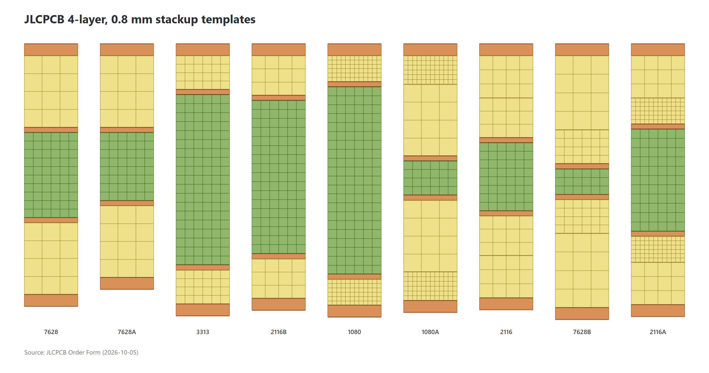

# microwave-ablation-antenna
Planar Microwave Ablation Antenna

## JLCPCB 4-layer, 0.8 mm stackup templates

Nominal stackups listed on the JLCPCB order form (FR-4, 4 layers, 0.8 mm, 1 oz outer / 0.5 oz inner), drawn at one common scale. Per-template tables are in [`pcb_stackup/jlcpcb_4layer_0p8mm/`](pcb_stackup/jlcpcb_4layer_0p8mm/).

